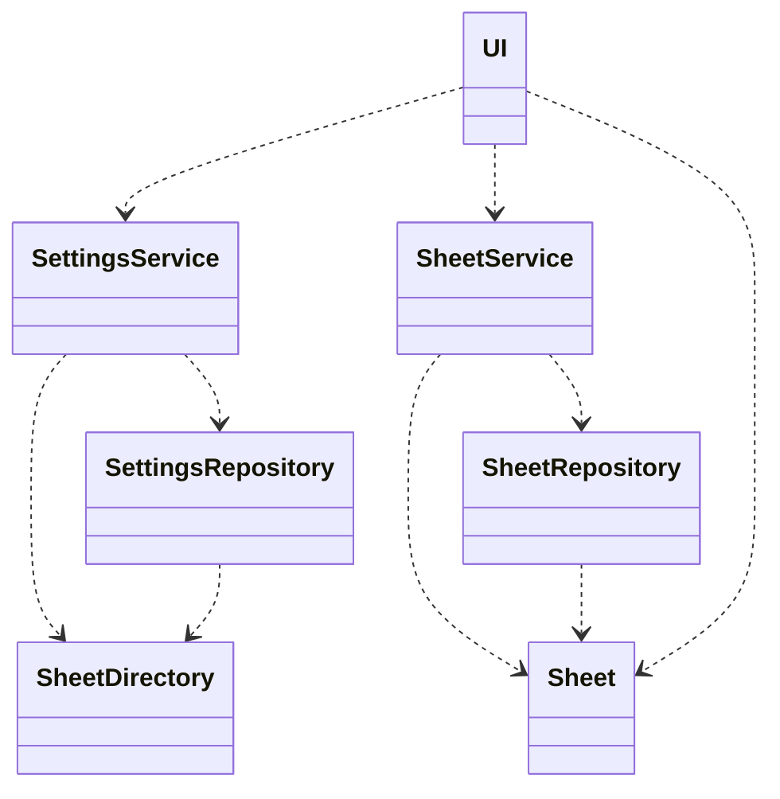
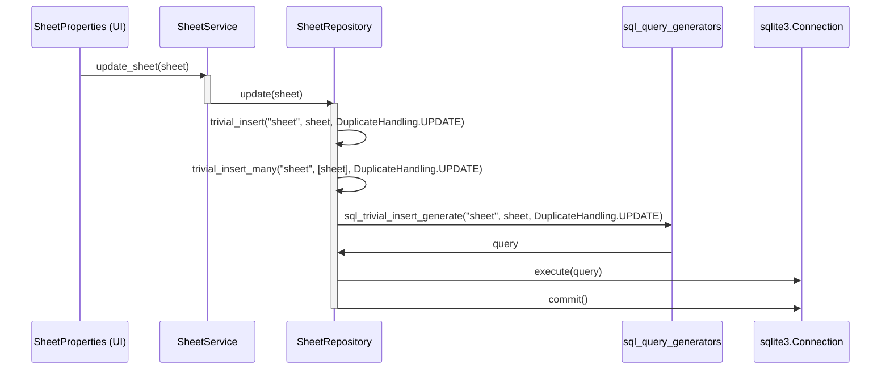

# Arkkitehtuurikuvaus

## Luokkakaavio

```mermaid
classDiagram
    class UI

    class SettingsService
    class SheetService

    class SettingsRepository
    class SheetRepository

    class Sheet
    class SheetDirectory

    UI..>SettingsService
    UI..>SheetService
    SettingsService..>SettingsRepository
    SheetService..>SheetRepository
    SheetService..>Sheet
    SheetRepository..>Sheet
    SettingsService..>SheetDirectory
    SettingsRepository..>SheetDirectory
    UI..>Sheet
```

## Sekvenssikaavio tapahtumasta nuotin tietojen muokkaus

```mermaid
sequenceDiagram
    SheetProperties (UI) ->>SheetService: update_sheet(sheet)
    activate SheetService
    SheetService ->>SheetRepository: update(sheet)
    deactivate SheetService
    activate SheetRepository
    SheetRepository ->>SheetRepository: trivial_insert("sheet", sheet, DuplicateHandling.UPDATE)
    SheetRepository ->>SheetRepository: trivial_insert_many("sheet", [sheet], DuplicateHandling.UPDATE)
    SheetRepository ->>sql_query_generators: sql_trivial_insert_generate("sheet", sheet, DuplicateHandling.UPDATE)
    sql_query_generators ->>SheetRepository: query
    SheetRepository ->>sqlite3.Connection: execute(query)
    SheetRepository ->>sqlite3.Connection: commit()
    deactivate SheetRepository

```
