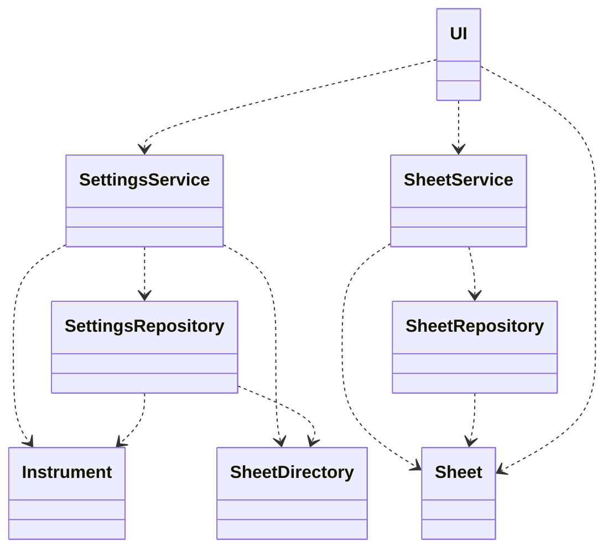
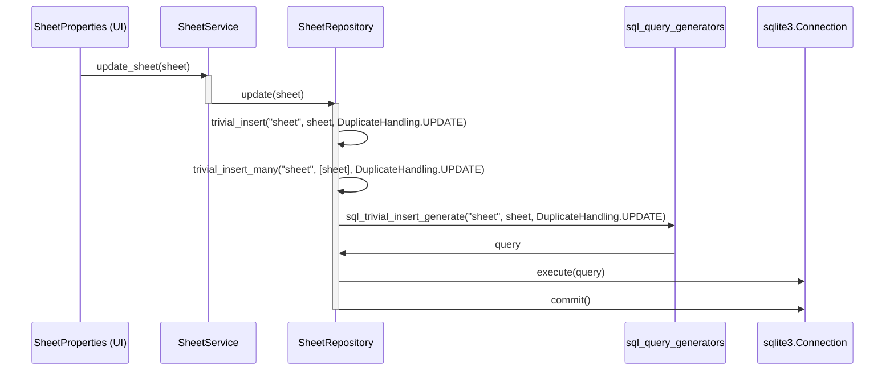

# Arkkitehtuurikuvaus

Sovellus tallentaa tietonsa SQLite-tietokantaan, jonka skeema löytyy tiedostosta `src/schema.sql` ja heijastuu `src/entities/` -hakemiston entity-luokissa.

`src/repositories/` -hakemistosta löytyy repositorioluokkia, jotka hallinnoivat näiden olioiden noutoa tietokannasta ja tallennuksesta sinne.
Eritystapaus repositorioluokista on `BaseRepository`, jonka muiden repositorioiden on tarkoitus periä saadakseen yleisiä tietokannan käyttötapoja helpommin käyttöönsä.

`src/services/` -hakemistossa on service-luokkia joiden tarkoitus olisi huolehtia sovelluslogiikasta.
Tämän sovelluksen tapauksessa logiikkaa ei kuitenkaan ole kovinkaan paljoa, joten kyseisten luokkien rooli jää repositorioluokkien wrapperiksi.
Luokat ovat kuitenkin olemassa mikäli sovellusta laajennetaan ja logiikkaa CRUD-operaatioiden ulkopuolelta tarvitaan.

`src/user_interface/` sisältää käyttöliittymäkoodin, joka on tekemisissä muun applikaation kanssa service-luokkien kautta.
Käyttöliittymän on jaoteltu luokkiin ns. komponenteittain ja ylemmän tason komponentit voivat koostua useammasta muusta komponentista.
Asetusvalikkoa koskeva koodi on erillään `src/user_interface/preference_window/` -hakemistossa.

## Luokkakaavio

## Sekvenssikaavio tapahtumasta nuotin tietojen muokkaus

