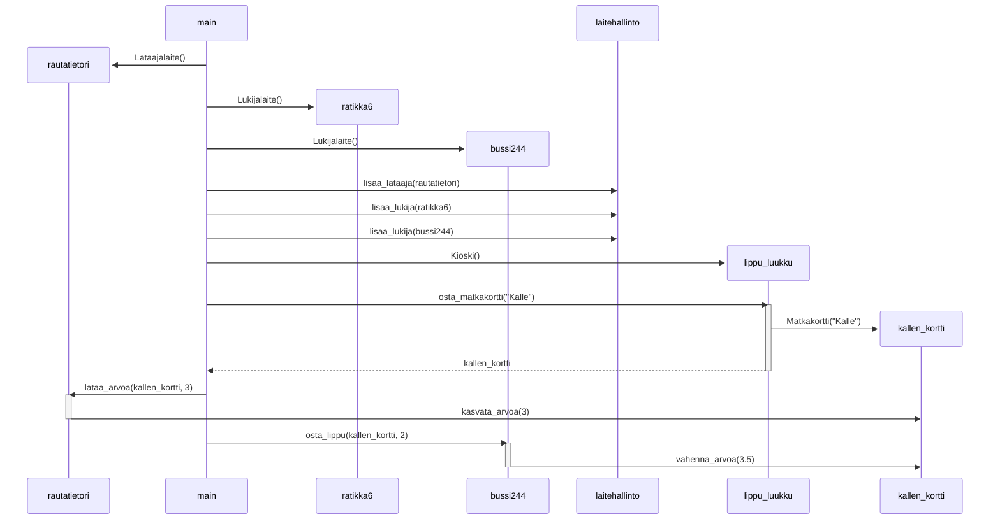

```mermaid
sequenceDiagram
    create participant rautatietori
    main ->>rautatietori: Lataajalaite()
    create participant ratikka6
    main ->>ratikka6: Lukijalaite()
    create participant bussi244
    main ->>bussi244: Lukijalaite()
    main ->>laitehallinto: lisaa_lataaja(rautatietori)
    main ->>laitehallinto: lisaa_lukija(ratikka6)
    main ->>laitehallinto: lisaa_lukija(bussi244)
    create participant lippu_luukku
    main ->>lippu_luukku: Kioski()
    main ->>lippu_luukku: osta_matkakortti("Kalle")
    activate lippu_luukku
    create participant kallen_kortti
    lippu_luukku->>kallen_kortti: Matkakortti("Kalle")
    lippu_luukku-->>main: kallen_kortti
    deactivate lippu_luukku
    main->>rautatietori: lataa_arvoa(kallen_kortti, 3)
    activate rautatietori
    rautatietori->>kallen_kortti: kasvata_arvoa(3)
    deactivate rautatietori
    main->>bussi244: osta_lippu(kallen_kortti, 2)
    activate bussi244
    bussi244->>kallen_kortti: vahenna_arvoa(3.5)
    deactivate bussi244
```
